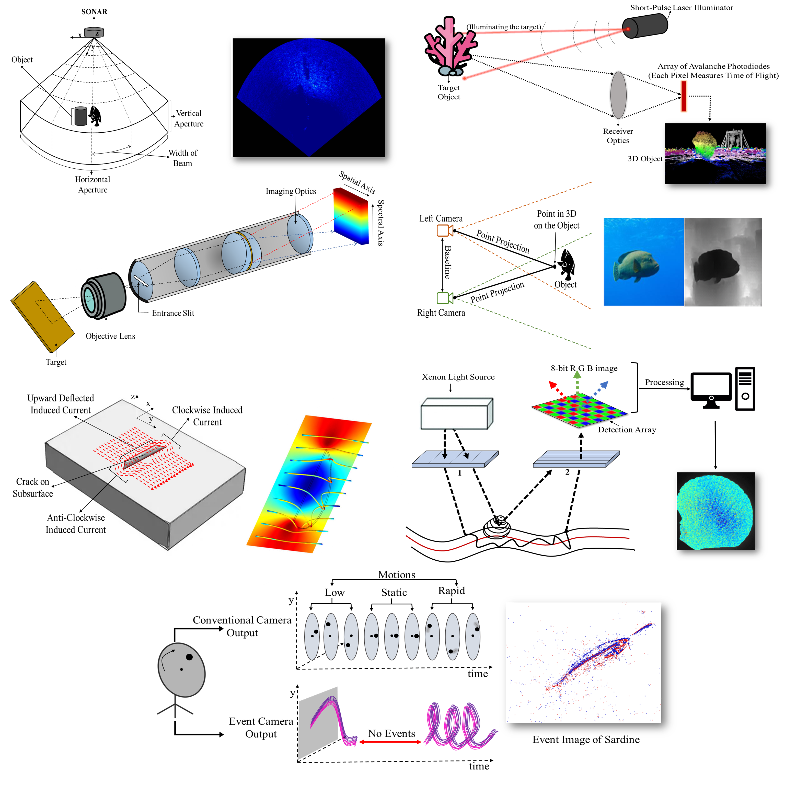

<h1 align="center">
  <br>
  Awesome-Underwater-Deep-Learning-Models-and-Datasets
</h1>

<h2 align="center">
Authors:</h2>

<div align="center">
  <a href="https://scholar.google.com/citations?user=KyBKIm8AAAAJ&hl=en">Mahmoud Elmezain</a> &nbsp;•&nbsp;
  <a href="https://scholar.google.com/citations?user=5u957S4AAAAJ&hl=en">Lyes Saad Saoud</a> &nbsp;•&nbsp;
  <a href="https://scholar.google.com/citations?user=2_e4vboAAAAJ&hl=en">Atif Sultan</a> &nbsp;•&nbsp;
  <br/>
  <a href="https://scholar.google.com/citations?user=aH4KHD4AAAAJ&hl=en">Mohamed Heshmat</a> &nbsp;•&nbsp;
  <a href="https://scholar.google.com/citations?user=MIqCjoIAAAAJ&hl=en">Lakmal Seneviratne</a> &nbsp;•&nbsp;
  <a href="https://scholar.google.com/citations?user=bCC3kdUAAAAJ&hl=en">Irfan Hussain</a> &nbsp;
  <br/>
</div>

<h4 align="center">
  <a href="https://ieeexplore.ieee.org/abstract/document/10852283/"><b>Paper</b></a> &nbsp; 
</h4>


[cc-by-sa]: http://creativecommons.org/licenses/by-sa/4.0/
[cc-by-sa-shield]: https://img.shields.io/badge/License-CC%20BY--SA%204.0-lightgrey.svg

---

# About this repo
This repo accompanies our review of deep learning-based underwater vision and will collect benchmark datasets and models for underwater image enhancement, object detection, classification, segmentation, and tracking, including recent SOTA architectures. We also cover non‑optical and multi-modal sensing,such as event cameras, sonar, LiDAR, magnetic imaging, hyperspectral imaging, and stereo cameras.
<p align="center">
  
</p>

# Datasets
## Underwater Image Enhancement
- **UIEB** in *IEEE Transactions on Image Processing* (2020) [Paper](https://doi.org/10.1109/TIP.2019.2955241) [Dataset](https://li-chongyi.github.io/proj_benchmark.html)
- **EUVP** in *IEEE Robotics and Automation Letters* (2020) [Paper](https://doi.org/10.1109/LRA.2020.2974710) [Dataset](https://irvlab.cs.umn.edu/resources/euvp-dataset)
- **U45** in *arXiv* (2019) [Paper](https://arxiv.org/abs/1906.06819) [Dataset](https://github.com/IPNUISTlegal/underwater-test-dataset-U45-)
- **RUIE** in *IEEE Transactions on Circuits and Systems for Video Technology* (2020) [Paper](https://doi.org/10.1109/TCSVT.2019.2963772) [Dataset](https://github.com/dlut-dimt/Realworld-Underwater-Image-Enhancement-RUIE-Benchmark)
- **UID2021** in *ACM Transactions on Multimedia Computing, Communications, and Applications* (2023) [Paper](https://doi.org/10.1145/3578584) [Dataset](https://github.com/Hou-Guojia/UID2021)
- **HICRD** in *Remote Sensing* (2022) [Paper](https://doi.org/10.3390/rs14174297) [Dataset](https://data.csiro.au/collection/csiro:49488)
- **LSUI** in *IEEE Transactions on Image Processing* (2023 [Paper](https://doi.org/10.1109/TIP.2023.3276332) [Dataset](https://github.com/LintaoPeng/U-shape_Transformer_for_Underwater_Image_Enhancement)
- **DRUVA** in *ICCV* (2023) [Paper](https://openaccess.thecvf.com/content/ICCV2023/html/Varghese_Self-supervised_Monocular_Underwater_Depth_Recovery_Image_Restoration_and_a_Real-sea_ICCV_2023_paper.html) [Dataset](https://github.com/nishavarghese15/DRUVA)
- **SQUID** in *IEEE Transactions on Pattern Analysis and Machine Intelligence* (2020) [Paper](https://doi.org/10.1109/TPAMI.2020.2977624) [Dataset](https://zenodo.org/records/5744037)
  
## Underwater Object Classification, Detection and Segmentation
- **WildFish** for Fish Classification in *Proceedings of the 26th ACM International Conference on Multimedia* (2018) [Paper](https://dl.acm.org/doi/10.1145/3240508.3240616) [Dataset](https://github.com/PeiqinZhuang/WildFish)
- **WildFish++** for Fish Classification in *IEEE Transactions on Multimedia* (2020) [Paper](https://doi.org/10.1109/TMM.2020.3028482) [Dataset](https://github.com/PeiqinZhuang/WildFish)
- **FishNet** for Fish Classification, Bounding-box Detection, Trait Prediction in *ICCV* (2023) [Paper](https://openaccess.thecvf.com/content/ICCV2023/html/Khan_FishNet_A_Large-scale_Dataset_and_Benchmark_for_Fish_Recognition_Detection_ICCV_2023_paper.html) [Dataset](https://fishnet-2023.github.io/)
- **Fish4Knowledge** for Fish Classification in *ICPR* (2012) [Paper](https://ieeexplore.ieee.org/document/6460437)  [Dataset](https://homepages.inf.ed.ac.uk/rbf/fish4knowledge/)
- **FishDet-M** for Fish Detection in *arxiv* (2025) [Paper](https://arxiv.org/abs/2507.17859) [Dataset](https://zenodo.org/records/16355312)
- **USOD10K** for Generic Segmentation (Underwater Salient Object Detection) in *IEEE Transactions on Image Processing* (2023) [Paper](https://doi.org/10.1109/TIP.2023.3266163) [Dataset](https://github.com/LinHong-HIT/USOD10K)
- **DUO** for Generic Bounding-box Underwater Object Detection in *ICMEW* (2021) [Paper](https://ieeexplore.ieee.org/document/9455997)  [Dataset](https://opendatalab.com/OpenDataLab/DUO)
- **RUOD** for Generic Bounding-box Underwater Object Detection in *Neurocomputing (2023) [Paper](https://www.sciencedirect.com/science/article/abs/pii/S0925231222013169)  [Dataset](https://github.com/dlut-dimt/RUOD)
- **UTTS** (subset of RUIE) for Marine Life Bounding-box Underwater Object Detection in *IEEE Transactions on Circuits and Systems for Video Technology* (2020) [Paper](https://doi.org/10.1109/TCSVT.2019.2963772) [Dataset](https://github.com/dlut-dimt/Realworld-Underwater-Image-Enhancement-RUIE-Benchmark)
- **UDD** for Marine Life Bounding-box Underwater Object Detection in *IEEE Transactions on Circuits and Systems for Video Technology* (2021) [Paper](https://ieeexplore.ieee.org/document/9496608)  [Dataset](https://github.com/chongweiliu/UDD_Official)
- **Brackish Dataset** for Marine Life Bounding-box Underwater Object Detection in *CVPRW* (2019) [Paper](https://openaccess.thecvf.com/content_CVPRW_2019/html/AAMVEM/Pedersen_Detection_of_Marine_Animals_in_a_New_Underwater_Dataset_with_CVPRW_2019_paper.html)  [Dataset](https://www.kaggle.com/datasets/aalborguniversity/brackish-dataset)
- **DFUI** for Marine Life Bounding-box Underwater Object Detection in *IEEE Transactions on Circuits and Systems for Video Technology* (2023) [Paper](https://ieeexplore.ieee.org/document/10113328)  [Dataset](https://github.com/xiaoDetection/Learning-Heavily-Degraded-Prior)
- **DUFish** for Fish Bounding-box Detection in *IEEE Internet of Things Journal* (2024) [Paper](https://ieeexplore.ieee.org/document/10421781)
- **UIIS (Watermask)** for Generic Instance Segmentation in *ICCV* (2023) [Paper](https://ieeexplore.ieee.org/document/10376692)  [Dataset](https://github.com/LiamLian0727/WaterMask)
- **LSUI** for Generic Segmentation (plus paired enhancement data) in *IEEE Transactions on Image Processing* (2023) [Paper](https://doi.org/10.1109/TIP.2023.3276332) [Dataset](https://github.com/LintaoPeng/U-shape_Transformer_for_Underwater_Image_Enhancement)
- **SUIM** for Generic Segmentation in *IROS* (2020) [Paper](https://doi.org/10.1109/IROS45743.2020.9340821) [Dataset](https://github.com/xahidbuffon/SUIM)
- **MAS3K** for Marine Animal Segmentation in *IEEE Transactions on Circuits and Systems for Video Technology* (2021) [Paper](https://ieeexplore.ieee.org/document/9471801)  [Dataset](https://github.com/LinLi-DL/MAS)
- **DSD** for Debris Bounding-box Detection in *ICRA* (2019) [Paper](https://ieeexplore.ieee.org/document/8793975) [Dataset](https://conservancy.umn.edu/items/c34b2945-4052-48fa-b7e7-ce0fba2fe649)
- **WPBB** for Plastic Waste Bounding-box Detection in *IEEE Robotics and Automation Letters* (2023) [Paper](https://ieeexplore.ieee.org/document/10044917)  [Dataset](https://github.com/fedezocco/MoreEffEffDetsAndWPBB-TensorFlow)
- **LIACI** for Underwater Ship Damage Segmentation in *IEEE Journal of Oceanic Engineering* (2023) [Paper](https://doi.org/10.1109/JOE.2022.3219129) [Dataset](https://liaci.sintef.cloud)
- **DUSIA** for Invertebrate Bounding-box Detection in *International Journal of Computer Vision* (2023) [Paper](https://link.springer.com/article/10.1007/s11263-023-01755-4) [Dataset](https://github.com/mcever/cdd4dusia)
- **CADDY** for Diver Intent Classification in *Journal of Marine Science and Engineering* (2019) [Paper](https://www.mdpi.com/2077-1312/7/1/16)  [Dataset](http://www.caddian.eu/)

## Underwater Object Tracking
- **UOT100** in *IEEE Journal of Oceanic Engineering* (2022) [Paper](https://doi.org/10.1109/JOE.2021.3086907)  [Dataset](https://www.kaggle.com/datasets/landrykezebou/uot100-underwater-object-tracking-dataset)
- **Multi-robot Convoying**  in *IROS* (2017) [Paper](https://doi.org/10.1109/IROS.2017.8206280)  [Dataset](https://github.com/Breakend/AquaBoxDataset)
- **UTB180**  in  *ACCV* 2022 (2022) [Paper](https://openaccess.thecvf.com/content/ACCV2022/papers/Alawode_UTB180_A_High-quality_Benchmark_for_Underwater_Tracking_ACCV_2022_paper.pdf)  [Dataset](https://www.kaggle.com/datasets/bastech/utb180)
- **FishTrack23** in *WACV* (2024) [Paper](https://openaccess.thecvf.com/content/WACV2024/papers/Dawkins_FishTrack23_An_Ensemble_Underwater_Dataset_for_Multi-Object_Tracking_WACV_2024_paper.pdf)  [Dataset](https://viame.kitware.com/#/collections)
  
# Deep Learning Models
## Underwater Image Enhancement
- **PhISH-Net** {physics-guided CNN} in *WACV* (2024). [Paper](https://openaccess.thecvf.com/content/WACV2024/papers/Chandrasekar_PhISH-Net_Physics_Inspired_System_for_High_Resolution_Underwater_Image_Enhancement_WACV_2024_paper.pdf)  [Code](https://github.com/chandrasekaraditya/PhISH-Net)
- **GCCF** {grouped-color CNN} in *Engineering Applications of Artificial Intelligence* (2024). [Paper](https://doi.org/10.1016/j.engappai.2023.107462)
- **Semi-UIR** {mean-teacher CNN} in *CVPR* (2023). [Paper](https://openaccess.thecvf.com/content/CVPR2023/papers/Huang_Contrastive_Semi-Supervised_Learning_for_Underwater_Image_Restoration_via_Reliable_Bank_CVPR_2023_paper.pdf)  [Code](https://github.com/Huang-ShiRui/Semi-UIR)
- **UIE-MCNN** {multi-scale CNN} in *IEEE Transactions on Broadcasting* (2023). [Paper](https://doi.org/10.1109/TBC.2022.3227424)
- **TANet** {dual-domain CNN} in *Expert Systems with Applications* (2024). [Paper](https://www.sciencedirect.com/science/article/pii/S0957417423031950)
- **TCTL-Net** {self-attention transformer} in *IEEE Transactions on Circuits and Systems for Video Technology* (2024). [Paper](https://doi.org/10.1109/TCSVT.2023.3328272)  [Code](https://github.com/trentqq/TCTL-Net)
- **UGIF-Net** {guided-flow CNN} for in *IEEE Transactions on Geoscience and Remote Sensing* (2023). [Paper](https://ieeexplore.ieee.org/document/10177702)
- **SARSDN (MSFRN)** {semantic-depth attention} in *Engineering Applications of Artificial Intelligence* (2023). [Paper](https://www.sciencedirect.com/science/article/pii/S0952197623007169)
- **CEWformer** {watermarking transformer} in *IEEE Journal of Oceanic Engineering* (2024). [Paper](https://doi.org/10.1109/JOE.2023.3310079)
- **UIE-Convformer** {conv-transformer hybrid} in *IEEE Transactions on Emerging Topics in Computational Intelligence* (2024). [Paper](https://ieeexplore.ieee.org/document/10430428)
- **Ghost-UNet** {diffusion U-Net} for in *Engineering Applications of Artificial Intelligence* (2024). [Paper](https://www.sciencedirect.com/science/article/pii/S0952197624007437)
- **AGA-based Swin Transformer** {group-attention transformer} in *IEEE Transactions on Instrumentation and Measurement* (2022). [Paper](https://doi.org/10.1109/TIM.2022.3189630)
- **Spectroformer** {cascaded transformer} in *WACV* (2024). [Paper](https://openaccess.thecvf.com/content/WACV2024/papers/Khan_Spectroformer_Multi-Domain_Query_Cascaded_Transformer_Network_for_Underwater_Image_Enhancement_WACV_2024_paper.pdf) [Code](https://github.com/Mdraqibkhan/Spectroformer)
- **Joint-ID** {joint-depth transformer} in *IEEE Sensors Journal* (2024). [Paper](https://ieeexplore.ieee.org/abstract/document/10351035)  [Code](https://github.com/sparolab/Joint_ID)
- **FUnIE-GAN** {lightweight GAN} for in *IEEE Robotics and Automation Letters* (2020). [Paper](https://ieeexplore.ieee.org/document/9001231)  [Code](https://github.com/xahidbuffon/funie-gan)
- **PUGAN** {physics-guided GAN} in *IEEE Transactions on Image Processing* (2023). [Paper](https://ieeexplore.ieee.org/document/10155564)  [Code](https://github.com/rmcong/PUGAN_TIP2023)
- **UW-GAN** {depth-aware GAN} in *IEEE Transactions on Instrumentation and Measurement* (2021). [Paper](https://doi.org/10.1109/TIM.2021.3120130)
- **NPT-UL** {style-transfer GAN} in *IEEE Transactions on Geoscience and Remote Sensing* (2024). [Paper](https://doi.org/10.1109/TGRS.2024.3363037)  [Code](https://github.com/JialeChu0311/NPT-UL)
- **HAAM-GAN** {attention-aggregation GAN} in *Engineering Applications of Artificial Intelligence* (2023). [Paper](https://www.sciencedirect.com/science/article/pii/S0952197623009272)  [Code](https://github.com/zhoujingchun03/HAAM-GAN)
- **UIENet / UIEGAN** {lightweight encoder GAN} in *IEEE Transactions on Geoscience and Remote Sensing* (2023). [Paper](https://doi.org/10.1109/TGRS.2023.3281741)
- **UwTGAN** {window transformer GAN} in *Engineering Applications of Artificial Intelligence* (2023). [Paper](https://www.sciencedirect.com/science/article/pii/S0952197623012538)
- **CURE-Net** {cascaded CNN} in *IEEE Journal of Oceanic Engineering* (2024). [Paper](https://ieeexplore.ieee.org/document/10087020)
- **CNMS** {cascaded-attention CNN} in *Neural Networks* (2024) [Paper](https://www.sciencedirect.com/science/article/abs/pii/S0893608023006317).
- **UIESC** {self-attention CNN} in *IEEE Transactions on Industrial Informatics* (2023) [Paper](https://ieeexplore.ieee.org/document/10054452).
- **DifSG2-CCL** {cycle-consistent GAN} in *IEEE Photonics Technology Letters* (2024) [Paper](https://ieeexplore.ieee.org/document/10731901) [Code](https://github.com/yff0428/DifSG2-CCL/tree/master).
- **MuLA-GAN** {multi-level GAN} in *Ecological Informatics* (2024) [Paper](https://www.sciencedirect.com/science/article/pii/S1574954124001730) [Code](https://github.com/AhsanBaidar/MuLA_GAN).
- **HIFI-Net** {fusion GAN} in *IEEE Signal Processing Letters* (2024) [Paper](https://ieeexplore.ieee.org/document/10473103).
- **UMRD** {disentangled GAN} in *IEEE Journal of Oceanic Engineering* (2024) [Paper](https://ieeexplore.ieee.org/document/10275315).
- **UCL-Dehaze** {contrastive GAN} in *IEEE Transactions on Geoscience and Remote Sensing* (2024) [Paper](https://ieeexplore.ieee.org/document/10398257).
  
## Underwater Object Classification
- **DAMNet** {dual-attention CNN} for underwater biological species classification in *IEEE Access* (2023). [Paper](https://doi.org/10.1109/ACCESS.2022.3227046)
- **MCANet** {multi-attention CNN} for underwater image classification across degraded conditions in *Computers & Electrical Engineering* (2023). [Paper](https://www.sciencedirect.com/science/article/pii/S0045790623001489)
- **DARE** {temporal CNN} for diver action recognition in underwater human-robot interaction in *IEEE Access* (2023). [Paper](https://doi.org/10.1109/ACCESS.2023.3298304)
- **WildFishNet** {fusion CNN} for open‑set wild fish recognition in *IEEE Journal of Selected Topics in Applied Earth Observations and Remote Sensing* (2023). [Paper](https://doi.org/10.1109/JSTARS.2023.3299703) [Code](https://github.com/BaoxiangHuang/WildFishNet)
- **TSVT** {token‑selective ViT} for fine‑grained marine organism classification in *Frontiers in Marine Science* (2023). [Paper](https://doi.org/10.3389/fmars.2023.1174347)
- **RRCommNet** {self‑attention CNN} for underwater diver gesture / command recognition in *IEEE/RSJ IROS* (2022). [Paper](https://doi.org/10.1109/IROS47612.2022.9981450) [Code](https://github.com/enansakib/rrcomm)
- **MLR‑VGGNet** {residual VGG} for fish species classification in *Journal of King Saud University - Computer and Information Sciences* (2022). [Paper](https://doi.org/10.1016/j.jksuci.2021.05.015)
- **mResNet** {dilated ResNet} for fish and marine object classification in underwater surveillance in *IEEE Transactions on Intelligent Transportation Systems* (2022). [Paper](https://doi.org/10.1109/TITS.2022.3168806)
- **Shuffle‑Xception** {hybrid CNN} for deep‑sea debris classification in *IEEE Journal of Selected Topics in Applied Earth Observations and Remote Sensing* (2021). [Paper](https://doi.org/10.1109/JSTARS.2021.3107853) [Code](https://github.com/BaoxiangHuang/Debris-detection)
- **VGG19 + CBAM** {attention VGG19} for Crown‑of‑Thorns starfish and coral identification in *PLOS ONE* (2023). [Paper](https://doi.org/10.1371/journal.pone.0283121) [Data1](https://www.kaggle.com/datasets/antonsibilev/crownofthorns-starfish) [Data2](https://www.kaggle.com/datasets/hugonaya/crown-of-thorns-starfish) [Data3](https://www.kaggle.com/datasets/sonainjamil/bleached-corals-detection)
- **Fish‑TViT** {transfer ViT} for fish species classification across clear and murky waters in *Heliyon* (2023). [Paper](https://doi.org/10.1016/j.heliyon.2023.e16761)
- **GANomly (GANomaly)** {GAN autoencoder} for anomaly detection of marine current turbine blade attachments in *Applied Ocean Research* (2024). [Paper](https://doi.org/10.1016/j.apor.2024.104034)

## Underwater Object Detection
- **FPN-based joint UOD network** {FPN CNN} for generic underwater object detection (UOD) for AUVs in *IEEE Transactions on Neural Networks and Learning Systems* (2022). [Paper](https://doi.org/10.1109/TNNLS.2021.3072414)
- **Boosting R-CNN** {two-stage R-CNN} for generic underwater object detection (UOD) in *Neurocomputing* (2023). [Paper](https://doi.org/10.1016/j.neucom.2023.01.088) [Code](https://github.com/mousecpn/Boosting-R-CNN)
- **GCC-Net** {CNN–Transformer} for generic underwater object detection (UOD) via cross-domain fusion in *Pattern Recognition* (2024). [Paper](https://doi.org/10.1016/j.patcog.2023.110222) [Code](https://github.com/Ixiaohuihuihui/GCC-Net)
- **MLDet** {FPN detector} for marine litter detection on AUV imagery in *Ocean & Coastal Management* (2023). [Paper](https://www.sciencedirect.com/science/article/pii/S0964569123002909) [Code](https://github.com/Vipermdl/MLDet)
- **YOLOTrashCan** {YOLO-based} for marine debris detection on TrashCan 1.0 in *IEEE Transactions on Instrumentation and Measurement* (2023). [Paper](https://ieeexplore.ieee.org/document/9964179)
- **SWIPENET** {CNN+Curriculum Multi-Class Adaboost Training} for marine life detection in noisy underwater scenes in *Pattern Recognition* (2022). [Paper](https://www.sciencedirect.com/science/article/pii/S0031320322004071) [Code](https://github.com/XrosLiang/SWIPENet)
- **RBU-TA YOLO** {YOLO attention} for marine organism detection in noisy aquaculture videos in *Applied Soft Computing* (2024). [Paper](https://doi.org/10.1016/j.asoc.2024.111291)
- **FSCW-YOLOv5** {few-shot YOLO} for few-shot cross-domain underwater object detection in *Frontiers in Marine Science* (2023). [Paper](https://www.frontiersin.org/journals/marine-science/articles/10.3389/fmars.2023.1151112/full)[Code](https://github.com/roadhan/FSCW)
- **USSTD-YOLOv8n** {YOLOv8-based} for small-size underwater object detection in *IEEE Access* (2024). [Paper](https://doi.org/10.1109/ACCESS.2024.3400962)
- **Weighted multi-error entropy YOLO** {YOLO-based} for generic underwater object detection under illumination noise in *Engineering Applications of Artificial Intelligence* (2024). [Paper](https://www.sciencedirect.com/science/article/pii/S0952197623019504)
- **DU-MobileYOLO** {YOLO MobileViT} for lightweight marine organism detection in *IEEE Transactions on Instrumentation and Measurement* (2024). [Paper](https://doi.org/10.1109/TIM.2024.3385846) [Code](https://github.com/ZERO-SPACE-X/DU-MobileYOLO)
- **MAD-YOLO** {YOLO-based} for dense small-scale marine benthos detection in *Ecological Informatics* (2023). [Paper](https://doi.org/10.1016/j.ecoinf.2023.102022) [Code](https://github.com/JoeNan1/MAD-YOLO)
- **Learnable Query DETR** {DETR} for underwater object detection for aquaculture and environmental monitoring in *PLOS ONE* (2024). [Paper](https://journals.plos.org/plosone/article?id=10.1371/journal.pone.0298739)
- **DSDebrisNet** {YOLOv5-based} for instant deep sea debris detection for AUVs/ROVs in *Science of The Total Environment* (2023). [Paper](https://www.sciencedirect.com/science/article/pii/S0048969723014420) [Code](https://github.com/BaoxiangHuang/DSDebrisNet)
- **FMAW-YOLOv5s** {FasterNet and attention + YOLO} for underwater methane plume detection from optical images in *Applied Ocean Research* (2024). [Paper](https://doi.org/10.1016/j.apor.2024.104217)
- **SGCA-BDCNet** {deformable CNN} for benthic organism detection in seabed imagery in *IEEE Transactions on Artificial Intelligence* (2024). [Paper](https://ieeexplore.ieee.org/abstract/document/10494116?casa_token=2Ki23ugfhfgAAAAA:xF8XoQqsJksW2uXKCCZN93VrkYMB1-YHE81j8mNWAi_YVasbhv0_bCOQHTd_38NylwJ44tM)
- **AGW-YOLOv8** {YOLOv8-based} for generic underwater object detection with attention and GSConv in *Scientific Reports* (2024). [Paper](https://www.nature.com/articles/s41598-024-75809-z)
- **YOLOv8-LA** {YOLOv8-based} for small-size underwater target detection in *Scientific Reports* (2024). [Paper](https://www.nature.com/articles/s41598-024-66950-w)
- **UDMDet** {FPN detector} for ambiguous / camouflaged underwater object detection in *IEEE Transactions on Industrial Informatics* (2024). [Paper](https://ieeexplore.ieee.org/abstract/document/10496913?casa_token=9ndmYUFl0OoAAAAA:n7UsjJCrBqQs4YxNEFTvdr-HL6u4CUWpVPQGY7Sdz1SyNfjAa7d63RWP6Zve_AmaB8nm7mw) [Code](https://github.com/bilityniu/UDMDet_TII)
- **DJL-Net** {dual-branch CNN} for generic underwater object detection with joint learning in *Knowledge-Based Systems* (2024). [Paper](https://www.sciencedirect.com/science/article/pii/S0950705124003071) 
- **PE-Transformer** {Transformer det.} for small-size underwater object detection in *Expert Systems with Applications* (2024). [Paper](https://doi.org/10.1016/j.eswa.2024.123253) 
- **FocusDet** {FPN/PAN CNN} for general small-object detection (including underwater targets) in *Scientific Reports* (2024). [Paper](https://www.nature.com/articles/s41598-024-61136-w) 
- **AWBiFPN** {BiFPN CNN} for marine object detection with augmented bidirectional FPN in *Expert Systems with Applications* (2024). [Paper](https://doi.org/10.1016/j.eswa.2023.121688) [Code](https://github.com/YuanGao01/AWBiFPN)
- **CAM-RCNN** {Mask R-CNN} for marine animal instance segmentation/detection in trawl imagery in *Neurocomputing* (2024). [Paper](https://www.sciencedirect.com/science/article/pii/S0925231224002595) [Code](https://github.com/Intenzo21/Coordinate-Aware-Mask-R-CNN-with-Group-Normalization-Towards-Improved-Underwater-Instance-Segm)
- **UNDERWATER-CUT** {two-stage YOLOv5} for obstacle detection and environment perception for UUVs in *Applied Ocean Research* (2023). [Paper](https://doi.org/10.1016/j.apor.2023.103510)
- **Faster R-CNN** for automatic detection of seafloor marine litter from towed camera images in *Marine Pollution Bulletin* (2021). [Paper](https://doi.org/10.1016/j.marpolbul.2021.111974)

## Underwater Object Segmentation
- **BCMNet** {hybrid CNN-Transformer} for marine animal segmentation (MAS) on MAS3K in *IEEE Transactions on Circuits and Systems for Video Technology* (2023). [Paper](https://doi.org/10.1109/TCSVT.2023.3264442) [Code](https://github.com/chasecjg/BCMNet)
- **Dual-SAM** {dual SAM} for marine animal segmentation (MAS) on MAS3K and related MAS benchmarks in *IEEE/CVF Conference on Computer Vision and Pattern Recognition (CVPR)* (2024). [Paper](https://ieeexplore.ieee.org/document/10657195) [Code](https://github.com/Drchip61/Dual_SAM)
- **PSS-net** {parallel FCN} for marine animal segmentation (MAS) on MAS3K in *Frontiers in Marine Science* (2022). [Paper](https://doi.org/10.3389/fmars.2022.1003568) [Code](https://github.com/Kimyuhwanpeter/marine_segmentation)
- **MASNet** {siamese CNN} for robust marine animal segmentation (MAS) on MAS3K in *IEEE Journal of Oceanic Engineering* (2024). [Paper](https://doi.org/10.1109/JOE.2023.3252760) [Code](https://github.com/zhenqifu/MASNet)
- **ECD-Net** {cascade CNN} for marine animal segmentation (MAS) on MAS3K in *IEEE Transactions on Circuits and Systems for Video Technology* (2021). [Paper](https://doi.org/10.1109/TCSVT.2021.3093890) [Code](https://github.com/LinLi-DL/MAS)
- **MTHI-Net** {multi-task CNN} for underwater ship hull defect segmentation and classification in *Ocean Engineering* (2024). [Paper](https://doi.org/10.1016/j.oceaneng.2024.117608)
- **RMP-Net** {RepVGG FCN} for seabed and marine scene segmentation on SUIM in *Frontiers in Marine Science* (2022). [Paper](https://doi.org/10.3389/fmars.2022.1032287) 
- **A-LCFCN** {weakly supervised FCN} for weakly supervised underwater fish segmentation in *Scientific Reports* (2021). [Paper](https://doi.org/10.1038/s41598-021-96610-2) [Code](https://github.com/IssamLaradji/affinity_lcfcn)
- **MAFEM** {attention CNN} for fish image segmentation in aquaculture environments (Fish4Knowledge) in *Marine Environmental Research* (2023). [Paper](https://doi.org/10.1016/j.marenvres.2023.106085)
- **CoralSCOP** {SAM-based} for dense coral image segmentation on the CoralMask dataset in *IEEE/CVF Conference on Computer Vision and Pattern Recognition (CVPR)* (2024). [Paper](https://openaccess.thecvf.com/content/CVPR2024/papers/Zheng_CoralSCOP_Segment_any_COral_Image_on_this_Planet_CVPR_2024_paper.pdf) [Code](https://github.com/zhengziqiang/CoralSCOP)
- **UWSNet** {attention encoder-decoder} for few-shot underwater semantic segmentation on the UWS dataset in *IEEE/RSJ International Conference on Intelligent Robots and Systems (IROS)* (2023). [Paper](https://ieeexplore.ieee.org/document/10342227) [Code](https://github.com/Imran2205/uwsnet)
- **Point Label Aware Superpixels** {DeepLabV3+} for weakly supervised multi-species coral reef segmentation on the Eilat and UCSD Mosaics datasets in *IEEE Robotics and Automation Letters* (2022). [Paper](https://ieeexplore.ieee.org/document/9813385) [Code](https://github.com/sgraine/point-label-aware-superpixels)
- **MA²-Net** {lightweight attention CNN} for side-scan sonar seabed target segmentation in AUV-based intelligent marine surveys in *IEEE Transactions on Automation Science and Engineering* (2024). [Paper](https://doi.org/10.1109/TASE.2024.3371963)
- **MA-AttUNet** {adversarial U-Net} for underwater dam crack segmentation with multi-level adversarial transfer learning in *Neurocomputing* (2022). [Paper](https://doi.org/10.1016/j.neucom.2022.07.036)
- **LinkNet + TL** {LinkNet and  transfer learning} for underwater dam crack pixel-wise identification and quantification in *Automation in Construction* (2022). [Paper](https://doi.org/10.1016/j.autcon.2022.104600) [Code](https://github.com/xiaoyufenfei/Efficient-Segmentation-Networks)

## Underwater Object Tracking
- **LightFC / LightFC‑ViT** {lightweight Siamese CNN} for underwater single-object tracking on UOT100 and UTB180 in *Knowledge-Based Systems* (2024). [Paper](https://doi.org/10.1016/j.knosys.2024.111439) [Code](https://github.com/LiYunfengLYF/LightFC)
- **UOSTrack** {CNN‑Transformer SOT} for tracking marine organisms for grasping with underwater vehicles (UOT100, UTB180) in *Ocean Engineering* (2023). [Paper](https://doi.org/10.1016/j.oceaneng.2023.115449) [Code](https://github.com/LiYunfengLYF/UOSTrack)
- **Tracking‑by‑detection stereo pipeline** {RetinaNet stereo} for multi-object tracking of deepwater animals from ROV video (Labelled FathomNet) in *IEEE/CVF Winter Conference on Applications of Computer Vision (WACV)* (2021). [Paper](https://openaccess.thecvf.com/content/WACV2021/html/Katija_Visual_Tracking_of_Deepwater_Animals_Using_Machine_Learning-Controlled_Robotic_Underwater_WACV_2021_paper.html)
- **Robust Confidence Tracking (RCT)** {confidence‑aware MOT} for multi-object tracking with unreliable detections on vehicle (DETRAC) and fish (FISHTRAC) datasets in *Pattern Recognition* (2023). [Paper](https://doi.org/10.1016/j.patcog.2022.109107) [Code](https://github.com/tmandel/fish-detrac)
- **FishTrack** {Pyramid Vision Transformer‑based MOT} for multi-object tracking of fish in aquaculture tanks using spatiotemporal information fusion in *Expert Systems with Applications* (2024). [Paper](https://doi.org/10.1016/j.eswa.2023.122194)
- **CMFTNet** {Joint Detection and Embedding‑style CNN} for multiple fish tracking in aquaculture ponds (OptMFT dataset) in *Computers and Electronics in Agriculture* (2022). [Paper](https://doi.org/10.1016/j.compag.2022.107018) [Code](https://github.com/vranlee/CMFTNet)
- **NewNet‑62** {SiamRPN++ CNN} for underwater single-object tracking of marine organisms with an inverted residual bottleneck backbone in *IEEE Access* (2021). [Paper](https://doi.org/10.1109/ACCESS.2021.3056105)
- **SiamFCA** {Siamese + Coordinated Attention Mechanism} for real-time single-fish tracking in aquaculture using coordinate attention in *Computers and Electronics in Agriculture* (2024). [Paper](https://doi.org/10.1016/j.compag.2023.108542)
- **GN‑YOLOv5** {GhostNet YOLOv5} for multi-target tracking in aquaculture monitoring and fish behavior analysis with an underwater robot in *Ocean Engineering* (2023). [Paper](https://doi.org/10.1016/j.oceaneng.2023.116005)
- **TFMFT** {transformer‑based MOT} for multiple fish tracking in aquaculture ponds with complex backgrounds (MFT22 dataset) in *Computers and Electronics in Agriculture* (2024). [Paper](https://doi.org/10.1016/j.compag.2023.108600) [Code](https://github.com/vranlee/TFMFT)
- **ResNet50‑IBN Re‑ID MOT** {ResNet50‑IBN ReID} for robust multi-class fish-school tracking in natural marine pasture images in *Remote Sensing* (2022). [Paper](https://doi.org/10.3390/rs14164106)
- **MOSSE / Seq‑NMS / SiamMask pipeline** {hybrid SOT stack} for single-object tracking of Yellowfin Bream and movement behavior characterization in *Ecology and Evolution* (2021). [Paper](https://doi.org/10.1002/ece3.7656) [Code](https://github.com/slopezmarcano/automated-fish-tracking)
- **UMOTMA** {CNN‑LSTM memory} for underwater multiple-object tracking with memory aggregation on UMOT and fish-school datasets in *Frontiers in Marine Science* (2022). [Paper](https://doi.org/10.3389/fmars.2022.1071618) [Code](https://github.com/Zxl19990529/Underwater-Multiple-Object-Tracking-Dataset)

# Other Modalities 
<p align="center">
  
</p>

## Acoustic / Sonar imaging
- **MGFGNet** {attention CNN} for automatic underwater acoustic target recognition from spectrograms in *Frontiers in Marine Science* (2023). [Paper](https://www.frontiersin.org/articles/10.3389/fmars.2023.1306229/full)
- **LMA-Net** {FLS - Light Multiscale Attention CNN} for real-time forward-looking sonar image segmentation in *IEEE Transactions on Instrumentation and Measurement* (2024). [Paper](https://doi.org/10.1109/TIM.2023.3341127) [Data](https://github.com/mvaldenegro/marine-debris-fls-datasets/)
- **GD-DAGO** {attention CNN} for garbage detection and denoising in sonar images in *Neurocomputing* (2023). [Paper](https://doi.org/10.1016/j.neucom.2023.01.081)
- **R²CNN** {SSS - recurrent CNN} for side-scan sonar image segmentation for AUV perception in *Applied Ocean Research* (2021). [Paper](https://www.sciencedirect.com/science/article/pii/S0141118721000857)
- **Global+coarse pipeline** {FLS - classical CV/ML} for submarine pipeline segmentation in noisy forward-looking sonar images in *Applied Ocean Research* (2021). [Paper](https://www.sciencedirect.com/science/article/pii/S0141118721001681)
- **YOLOv5m** for automatic single-fish detection with a commercial echosounder and calibration in *Frontiers in Marine Science* (2023). [Paper](https://www.frontiersin.org/journals/marine-science/articles/10.3389/fmars.2023.1162064/full) [Code/Data](https://github.com/jfshanghai/YOLOv5-Echogram-EchoTrace-Detection-Dataset)
- **Diffusion+YOLOv7** for small-sample underwater target detection in sonar imagery in *Remote Sensing* (2023). [Paper](https://www.mdpi.com/2072-4292/15/19/4772)
- **MFSANet** {SSS - style transfer CNN} for zero-shot side-scan sonar image recognition via style transfer in *IEEE Geoscience and Remote Sensing Letters* (2023). [Paper](https://ieeexplore.ieee.org/abstract/document/10258393)
- **GCEANet** {SSS - attention CNN} for zero-shot side-scan sonar image classification with style transfer in *IEEE Transactions on Instrumentation and Measurement* (2024). [Paper](https://ieeexplore.ieee.org/abstract/document/10399359) [Code](https://github.com/baizhongyu/GCEANet)
- **Few-shot TL** {few-shot CNN} for underwater sonar image classification with few labeled samples in *IEEE Journal of Oceanic Engineering* (2023). [Paper](https://ieeexplore.ieee.org/abstract/document/10044968)
- **Sonar2Depth** {cGAN model} for 3D reconstruction and depth estimation from acoustic images in *IEEE/RSJ International Conference on Intelligent Robots and Systems (IROS)* (2023). [Paper](https://ieeexplore.ieee.org/abstract/document/10342251)
- **UAT-SSIC** {autoencoder CNN} for semantic-segmentation-based sonar image compression and acoustic transmission for cooperative SLAM in *Defence Technology* (2024). [Paper](https://doi.org/10.1016/j.dt.2023.05.012)
- **Self-supervised CNN** {FLS - CNN} for elevation angle estimation from 2D forward-looking sonar in *IEEE/RSJ International Conference on Intelligent Robots and Systems (IROS)* (2023). [Paper](https://ieeexplore.ieee.org/abstract/document/10341601)
- **Terrain-matching CNN** {MBS - CNN} for terrain-based underwater localization from sonar/terrain images in *IEEE Geoscience and Remote Sensing Letters* (2023). [Paper](https://ieeexplore.ieee.org/abstract/document/10041905)

## Stereo vision / Depth imaging
- **UWStereoNet** {unsupervised CNN} for unsupervised depth estimation and color correction from underwater stereo imagery in *IEEE International Conference on Robotics and Automation (ICRA)* (2019). [Paper](https://ieeexplore.ieee.org/abstract/document/8794272)
- **Multi-camera DL visual measurement method** for 3D trajectory estimation of underwater moving objects from multiple cameras in *IEEE Access* (2020). [Paper](https://ieeexplore.ieee.org/abstract/document/9217596)
- **AANet-based Architecture** for fish length and body-parameter estimation using underwater stereo vision in *IEEE Transactions on Emerging Topics in Computational Intelligence* (2024). [Paper](https://ieeexplore.ieee.org/abstract/document/10177273)
- **CNN-based Stereo Matching** for fish metric estimation in aquaculture cages using an intelligent underwater stereo camera in *IEEE Access* (2022). [Paper](https://ieeexplore.ieee.org/abstract/document/9804493)

## Laser / LiDAR imaging
- **NLEB network** {dilated CNN} for full-waveform bathymetric LiDAR denoising and depth estimation in *Remote Sensing* (2023). [Paper](https://www.mdpi.com/2072-4292/15/13/3293)
- **Binocular-laser fusion** {structured-light system} for underwater 3D reconstruction in low-light environments using structured light and laser scanning in *IEEE Transactions on Instrumentation and Measurement* (2023). [Paper](https://ieeexplore.ieee.org/abstract/document/10081436?casa_token=D5ojFqDgQZIAAAAA:EN2IBWlwTz2RSvlD7pw3kPKJtIgXQSxoeFCWkfC7Gq8C3j9xaXfJ6DN-elKJQpPmHff3e6hz)
- **Multispectral confocal LiDAR system** {AdaBoost.M2} for 3D imaging and classification of pelagic microorganisms and plankton in *Laser & Photonics Reviews* (2024). [Paper](https://doi.org/10.1002/lpor.202301291)
- **Mask-guided Network** {CNN detector} for fishing net detection and recognition from underwater range-gated laser images in *Optics & Laser Technology* (2024). [Paper](https://www.sciencedirect.com/science/article/pii/S0030399223012951)
- **PointNet++-based pose network** for surface and underwater human pose recognition from temporal 3D point clouds in *Scientific Reports* (2024). [Paper](https://doi.org/10.1038/s41598-023-50658-4)
  
## Hyperspectral imaging
- **TDSS-UTD** {3D CNN} for hyperspectral underwater target detection with spectral–spatial depth cues in *IEEE Transactions on Geoscience and Remote Sensing* (2023). [Paper](https://doi.org/10.1109/TGRS.2023.3275147)
- **UTD-Net** {CNN} for underwater target detection from hyperspectral imagery in *IEEE Journal of Selected Topics in Applied Earth Observations and Remote Sensing* (2021). [Paper](https://doi.org/10.1109/JSTARS.2021.3080919)
- **SUTDF** {CNN} for joint depth estimation and underwater target detection from hyperspectral data in *Remote Sensing* (2021). [Paper](https://doi.org/10.3390/rs13091721)
- **TUTDF** {CNN} for transfer‑based underwater target detection from synthetic-to-real hyperspectral imagery in *Remote Sensing* (2023). [Paper](https://doi.org/10.3390/rs15041023) [Code](https://github.com/lizheyong/TUTDF)
- **FBUD** {unsupervised detector} for coastal / near‑shore hyperspectral underwater target detection near the coastline in *IEEE Transactions on Geoscience and Remote Sensing* (2023). [Paper](https://doi.org/10.1109/TGRS.2023.3268299)

## Polarized imaging
- **MU-DLN** {modified U-Net} for underwater image restoration and polarization remote sensing in scattering media in *IEEE Transactions on Geoscience and Remote Sensing* (2022). [Paper](https://ieeexplore.ieee.org/document/9749212)
- **Physics-informed Network** for polarimetric underwater imaging in high turbidity using physics‑informed loss in *Optics Express* (2022). [Paper](https://opg.optica.org/oe/abstract.cfm?uri=oe-30-13-22512)
- **Polarimetric-Net** {Shallow Feature Extraction + Residual Dense Block + Dense Feature Fusion} for polarimetric underwater image recovery and dehazing in *Optics and Lasers in Engineering* (2020). [Paper](https://doi.org/10.1016/j.optlaseng.2020.106152)
- **Unsupervised CNN** for joint polarization‑ and binocular‑depth–based underwater imaging in *Optics Express* (2024). [Paper](https://opg.optica.org/oe/abstract.cfm?uri=oe-32-6-9904)
- **YOLOv4-based Polarimetric Detector** for polarimetric target detection in turbid, camouflaged underwater conditions in *Optics & Laser Technology* (2024). [Paper](https://www.sciencedirect.com/science/article/pii/S0030399224000070)
- **Stokes-parameter Detector** {CNN} for rapid detection of camouflaged artificial targets in turbid water using polarization Stokes parameters in *IEEE Photonics Journal* (2021). [Paper](https://doi.org/10.1109/JPHOT.2021.3103866)
- **Descatterring Network + DoP and AoP Calculation** {Multiscale local feature extraction + Encoder block + Decoder block} for high‑quality 3D shape recovery in turbid underwater scattering scenes in *Optics and Lasers in Engineering* (2024). [Paper](https://www.sciencedirect.com/science/article/pii/S0143816623004633)

## Magnetic imaging
- **Multiphysical Features Fusion CNN** {ACFM Sensor - CNN} for crack detection and quantification in underwater metallic structures using alternating current field measurement in *IEEE Transactions on Instrumentation and Measurement* (2024). [Paper](https://ieeexplore.ieee.org/document/10485559)
- **CNN Classifier** {ACFM Sensor - CNN} for defect identification from ACFM magnetic signals in underwater structures in *IEEE Transactions on Industrial Informatics* (2022). [Paper](https://ieeexplore.ieee.org/document/9556601)

## Event / Neuromorphic imaging
- **RGB–Event fusion framework** {RGB-event CNN} for multi‑degraded underwater image enhancement via RGB / event fusion in *Frontiers in Marine Science* (2024). [Paper](https://www.frontiersin.org/articles/10.3389/fmars.2024.1366815/full)
- **TransCODNet** {RGB-event MobileNet-V3+VarifocalLoss+VEM} for detection of transparently camouflaged underwater objects using RGB and event frames in *IEEE Robotics and Automation Letters* (2024). [Paper](https://doi.org/10.1109/LRA.2023.3346754) [Code/Data](https://github.com/lunaWU628/Aqua-Eye-Dataset)
- **Event-based circular detector** {SNN} for circular target detection in AUV docking using event cameras in *Frontiers in Neurorobotics* (2022). [Paper](https://www.frontiersin.org/articles/10.3389/fnbot.2021.815144/full)
- **Neuro-inspired Network** {Stimulus prioritization block+behavior arbitration block+output generation block} for trajectory control and navigation of a biomimetic swimming robot using frame and event cameras in *IEEE Robotics and Automation Letters* (2020). [Paper](https://ieeexplore.ieee.org/document/8988174)


# Bibtex 📚
```
@article{elmezain2025advancing,
  title={Advancing underwater vision: A survey of deep learning models for underwater object recognition and tracking},
  author={Elmezain, Mahmoud and Saoud, Lyes Saad and Sultan, Atif and Heshmat, Mohamed and Seneviratne, Lakmal and Hussain, Irfan},
  journal={IEEE Access},
  volume={13},
  pages={17830--17867},
  year={2025},
  publisher={IEEE}
}
```

